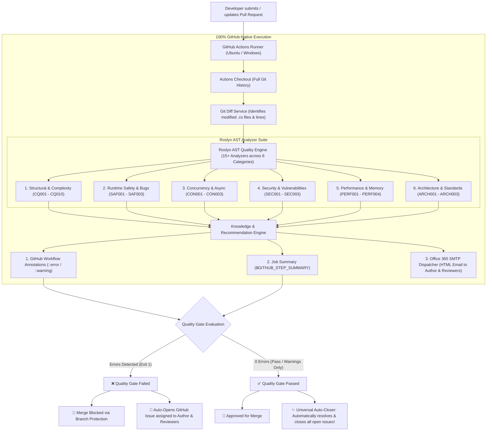
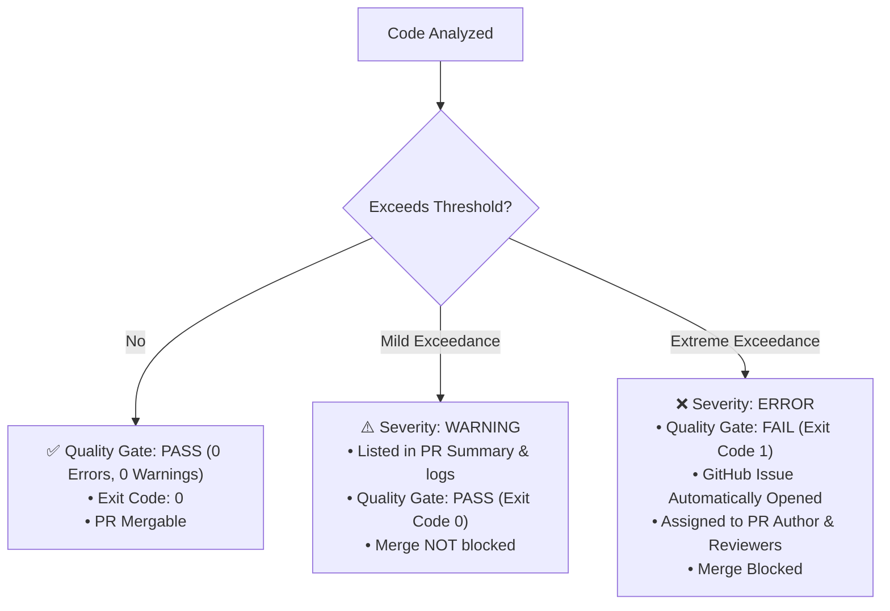
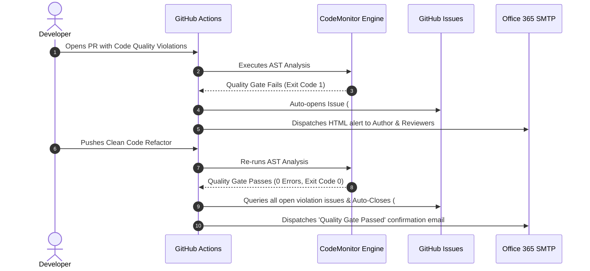

# 🛡️ Automated Code Quality Monitor (.NET 8 + Roslyn AST + GitHub Actions + Office 365 Alerting)

[](https://dotnet.microsoft.com/)
[](https://docs.microsoft.com/en-us/dotnet/csharp/)
[](https://github.com/dotnet/roslyn)
[](https://github.com/features/actions)
[](https://outlook.office.com/)
[](LICENSE)

An enterprise-grade, 100% GitHub-native automated code quality analyzer, architectural gate, and automated remediation engine. It performs deep **Roslyn AST (Abstract Syntax Tree)** static analysis on modified C# code during pull requests, injects inline annotations into the PR diff, publishes rich Markdown step summaries, enforces two-tier quality gates, automatically manages the **GitHub Issue lifecycle (creation & auto-close)**, and delivers responsive HTML review reports to authors and reviewers via **Microsoft Outlook / Office 365 SMTP**.

---

## 📐 Architecture & End-to-End Workflow



---

## 🔍 Comprehensive Roslyn AST Quality Rules

Our engine inspects C# source code at the syntax and semantic tree levels across **6 critical engineering categories**:

### 1. 🏗️ Structural & Complexity
| Rule ID | Rule Name | Threshold | Severity | Recommended Fix |
| :--- | :--- | :---: | :---: | :--- |
| `CQ001` | **Method Length Exceeded** | `> 50 lines` | Warning / Error (`> 75 lines`) | Apply **Extract Method** pattern to separate distinct responsibilities. |
| `CQ002` | **High Cyclomatic Complexity** | `> 10 paths` | Warning / Error (`> 15 paths`) | Replace branching with **Guard Clauses**, **Strategy**, or **Polymorphism**. |
| `CQ003` | **Excessive Parameter Count** | `> 4 params` | Warning / Error (`> 6 params`) | Introduce a **Parameter Object / Record DTO** or Builder pattern. |
| `CQ004` | **Deep Control Flow Nesting** | `> 3 levels` | Warning / Error (`> 4 levels`) | Invert conditionals with early returns (**Fail Fast** / Guard Clauses). |
| `CQ005` | **God Class Length** | `> 300 lines` | Warning | Split class according to **Single Responsibility Principle (SRP)**. |
| `CQ006` | **Constructor Parameter Clump**| `> 5 params` | Warning | Refactor excessive dependencies using Facades or MediatR. |
| `CQ007` | **High Cognitive Complexity** | `> 15 points` | Warning / Error (`> 25 points`)| Simplify nested mental overhead and extract sub-routines. |
| `CQ008` | **Excessive Inheritance Depth**| `> 3 base types`| Warning | Prefer **Composition over Inheritance**. |
| `CQ009` | **Method Bloat in Class** | `> 20 methods` | Warning | Decompose class into focused sub-modules. |
| `CQ010` | **Non-Exhaustive Switch** | Missing `default:` | Warning | Add a `default:` case or throw `ArgumentOutOfRangeException`. |

### 2. 🛡️ Runtime Safety & Defect Prevention
| Rule ID | Rule Name | Description | Severity | Recommended Fix |
| :--- | :--- | :--- | :---: | :--- |
| `SAF001` | **Potential Null Dereference** | Invoking members on unvalidated references | Error | Use C# Null-Conditional operator (`?.`) or Null-Coalescing (`??`). |
| `SAF002` | **Swallowed Exception** | Empty `catch {}` block hiding errors | Error | Log the exception with `ILogger` or rethrow with `throw;`. |
| `SAF003` | **Unchecked Division by Zero** | Division `/` or `%` without validating divisor | Error | Guard with `if (divisor == 0)` before arithmetic operations. |

### 3. ⚡ Concurrency & Thread Safety
| Rule ID | Rule Name | Description | Severity | Recommended Fix |
| :--- | :--- | :--- | :---: | :--- |
| `CON001` | **Async Void Anti-Pattern** | `async void` outside event handlers | Error | Return `Task` or `Task<T>` to allow proper exception observation. |
| `CON002` | **Lock on `this` / `typeof(T)`**| Locking on publicly accessible instances | Error | Use a dedicated `private readonly object _lock = new();`. |
| `CON003` | **Unobserved Background Task** | Calling async methods without `await` | Error | Properly `await` the Task or use structured background workers. |

### 4. 🔒 Security & Vulnerabilities
| Rule ID | Rule Name | Description | Severity | Recommended Fix |
| :--- | :--- | :--- | :---: | :--- |
| `SEC001` | **SQL Injection Risk** | String interpolation/concatenation in SQL | Error | Use parameterized queries (`SqlCommand.Parameters`) or Dapper/EF Core. |
| `SEC002` | **Hardcoded Secret / Password** | Secrets or API keys embedded in code | Error | Migrate credentials to Azure Key Vault, AWS Secrets, or GitHub Secrets. |
| `SEC003` | **Insecure Cryptographic Hash** | Using deprecated algorithms (`MD5`, `SHA1`)| Error | Upgrade to modern algorithms (`SHA256`, `SHA512`, `Argon2id`). |

### 5. 🚀 Performance & Memory
| Rule ID | Rule Name | Description | Severity | Recommended Fix |
| :--- | :--- | :--- | :---: | :--- |
| `PERF001` | **String Concatenation in Loop** | Repeated `+` string allocation in loops | Warning | Use `StringBuilder` to eliminate intermediate GC allocations. |
| `PERF002` | **Inefficient LINQ `.Count() > 0`**| Counting entire sequence to check presence| Warning | Use `.Any()` for short-circuit $O(1)$ evaluation. |
| `PERF003` | **Missing `ConfigureAwait(false)`** | Library async calls capturing context | Warning | Append `.ConfigureAwait(false)` to avoid UI/ASP.NET deadlocks. |
| `PERF004` | **Unbounded In-Memory Collection** | Unbounded growth in static/singleton caches | Warning | Introduce bounded caches with eviction policies (e.g. `MemoryCache`). |

### 6. 🏛️ Architecture & Clean Code Standards
| Rule ID | Rule Name | Description | Severity | Recommended Fix |
| :--- | :--- | :--- | :---: | :--- |
| `ARCH001` | **Layer Leakage / God Class** | Direct database queries in UI/Controllers | Error | Delegate data operations to a dedicated Repository / Service layer. |
| `ARCH002` | **Direct Console Output** | `Console.WriteLine` used in domain/service code| Warning | Inject and use `ILogger<T>` for structured logging. |
| `ARCH003` | **Public Mutable Fields** | Classes exposing non-encapsulated fields | Warning | Encapsulate with properties `{ get; set; }` or `{ get; init; }`. |

---

## ⚖️ Two-Tier Graduated Severity System

To maintain high developer velocity while preventing technical debt, the engine uses a graduated severity model:



* **Warnings ⚠️ (Advisory):** Mild overages (e.g., 51–75 lines, 11–15 complexity) provide actionable advice in the PR summary without breaking the build or delaying urgent PRs.
* **Errors ❌ (Blocking):** Severe overages (> 75 lines, > 15 complexity, safety/security violations) immediately fail the Quality Gate (Exit Code 1), open a tracking issue, and block PR merge.

---

## 🔄 Universal Issue Lifecycle & Auto-Closer



---

## 📧 Dynamic Reviewer Resolution & Office 365 Setup

### 1. Configure GitHub Secrets & Variables
Navigate to your repository on GitHub: **Settings > Secrets and variables > Actions > New repository secret**:

| Secret / Variable Name | Example Value | Description |
| :--- | :--- | :--- |
| `OUTLOOK_SENDER_EMAIL` | `bot@yourcompany.com` | Dedicated Microsoft 365 / Outlook sender address. |
| `OUTLOOK_APP_PASSWORD` | `xxxx xxxx xxxx xxxx` | 16-character Microsoft App Password with SMTP AUTH enabled. |
| `OUTLOOK_ADDITIONAL_RECIPIENTS` | `lead@company.com, manager@company.com` | *(Optional)* Additional emails (Lead, Manager) to CC on review alerts. |
| `OUTLOOK_RECIPIENT_EMAIL` | *(Optional)* `team@company.com` | Fallback primary recipient override. |

### 2. Microsoft Defender & Corporate Safe Attachments Compliance
* All emails are delivered over **TLS 1.2 / 1.3** using standard STARTTLS on port `587`.
* HTML reports use sanitized, inline CSS templates without external tracking pixels or blocked JavaScript, ensuring zero-risk delivery to corporate Outlook inboxes.

### 3. Enable Branch Protection (Block Merge on Failure)
1. Go to **Settings > Branches > Add branch protection rule**.
2. Set branch pattern to `main` (or `master`).
3. Check **"Require status checks to pass before merging"**.
4. Select `Roslyn AST Quality Analysis & Alerting` as the required check.

---

## 💻 Local Development & CLI Usage

### 1. Build the Tool
```powershell
dotnet build src/CodeMonitor/CodeMonitor.csproj -c Release
```

### 2. Run in Dry-Run Mode (Without sending email)
```powershell
dotnet run --project src/CodeMonitor/CodeMonitor.csproj -- --dry-run
```

### 3. Run Diff Analysis Against `main`
```powershell
dotnet run --project src/CodeMonitor/CodeMonitor.csproj -- --base-ref origin/main --dry-run
```

### 4. Run with Live Outlook SMTP Dispatch
```powershell
$env:OUTLOOK_SENDER_EMAIL="your-bot@outlook.com"
$env:OUTLOOK_APP_PASSWORD="your-app-password"
$env:OUTLOOK_RECIPIENT_EMAIL="developer@outlook.com"

dotnet run --project src/CodeMonitor/CodeMonitor.csproj
```

---

## 📂 Project Structure

```text
github_codereview/
├── .github/
│   └── workflows/
│       └── code-quality.yml          # GitHub Actions PR quality gate & issue auto-closer
├── qualityconfig.json                # Configurable quality thresholds and rules
├── src/
│   └── CodeMonitor/
│       ├── Analyzers/                # 15+ Roslyn AST Analyzers across 6 Categories
│       │   ├── ICodeAnalyzer.cs      # Core Analyzer Interface
│       │   ├── MethodLengthAnalyzer.cs
│       │   ├── ComplexityAnalyzer.cs
│       │   ├── ParameterCountAnalyzer.cs
│       │   ├── NestingDepthAnalyzer.cs
│       │   ├── RuntimeSafetyAnalyzer.cs
│       │   ├── ConcurrencyAnalyzer.cs
│       │   ├── SecurityAnalyzer.cs
│       │   ├── PerformanceAnalyzer.cs
│       │   └── ArchitectureAnalyzer.cs
│       ├── Knowledge/
│       │   └── RecommendationEngine.cs # Actionable 4-part refactoring blueprints
│       ├── Models/
│       │   ├── Violation.cs          # Violation data model with severity & fixes
│       │   ├── AnalysisReport.cs     # Aggregated scan report & Git metadata
│       │   └── QualityConfig.cs      # Threshold configuration parser
│       ├── Services/
│       │   ├── GitDiffService.cs     # Differential Git analysis (PR modified lines)
│       │   ├── GitHubReporter.cs     # Inline annotations & Step Summary generator
│       │   └── EmailService.cs       # MailKit/MimeKit Office 365 SMTP dispatcher
│       ├── Program.cs                # CLI Entry Point & Orchestrator
│       └── CodeMonitor.csproj        # .NET 8 LTS project manifest
├── .gitignore
└── README.md
```

---

## 📄 License
This project is licensed under the [MIT License](LICENSE).
