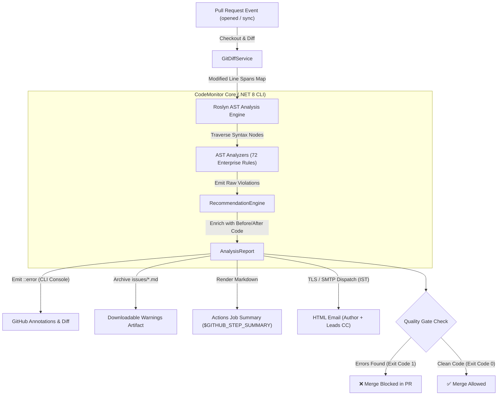

# Automated .NET Code Quality Monitor Project Documentation

This documentation provides a comprehensive overview of the **Automated .NET Code Quality Monitor & Merge Quality Gate** ecosystem, which enables automated, zero-SaaS, AST-based code analysis, PR merge blocking, and multi-channel reporting using the Microsoft Roslyn compiler platform and GitHub Actions.

---

## Architecture Overview

The system is designed as a decoupled, standalone CI/CD quality gate that operates natively within GitHub Actions runners. It eliminates reliance on costly external SaaS tools (such as SonarQube or CodeClimate) by executing the official **Microsoft Roslyn Compiler API** directly on the pull request changeset.

The system consists of five primary stages:
1. **Trigger & Environment Setup:** A developer opens, synchronizes, or reopens a Pull Request (or pushes to `main`/`develop`), initiating the GitHub Actions runner.
2. **Git Diff Isolation:** The `GitDiffService` parses the unified git diff between the target base branch and the PR head commit (`git diff --unified=0 base...HEAD`) to isolate modified line numbers.
3. **Roslyn AST Semantic Parsing:** The engine parses modified C# source files into genuine Abstract Syntax Trees (AST), runs custom analyzers across 6 spectrum categories (72 enterprise rules), and correlates structural metrics exclusively with the modified line spans.
4. **Knowledge Enrichment & Multi-Channel Reporting:** The `RecommendationEngine` generates rationale, CWE/OWASP metadata, and Before/After C# refactoring blueprints; `GitHubReporter` emits inline annotations on the PR diff, updates a sticky PR markdown comment, logs live to `$GITHUB_STEP_SUMMARY`, and archives warnings into timestamped markdown files; `EmailService` sends responsive HTML reports via Office 365 / SMTP with Team Lead and Manager CC support.
5. **Quality Gate Enforcement:** If critical violations (`Severity == Error`) exist, the process returns **Exit Code 1**, locking the PR merge button until all blocking violations are refactored. Clean code returns **Exit Code 0** allowing immediate merge.



---

## Codebase Structure & Component Breakdown

### Repository Architecture & Complete Directory Tree

```text
src/
|-- CodeMonitor/
|   |-- Analyzers/                       # Roslyn AST Rule Implementations (72 Enterprise Rules)
|   |   |-- ICodeAnalyzer.cs             # Common interface contract for all AST analyzers
|   |   |-- ArchitectureAnalyzer.cs      # Rules ARCH001-ARCH015: Naming standards & God class monoliths
|   |   |-- ComplexityAnalyzer.cs        # Rules CQ002, CQ005, CQ006: Decision branches & cognitive complexity
|   |   |-- ConcurrencyAnalyzer.cs       # Rules CON001-CON011: Deadlock cycles, async void & sync blocking
|   |   |-- MethodLengthAnalyzer.cs      # Rule CQ001: Statement line boundaries (>50 lines)
|   |   |-- NestingDepthAnalyzer.cs      # Rule CQ004: Block nesting depth & early guard clauses (>3 levels)
|   |   |-- ParameterCountAnalyzer.cs    # Rule CQ003: Method parameter count & data clumps (>4 params)
|   |   |-- PerformanceAnalyzer.cs       # Rules PERF001-PERF010: Boxing allocations, LINQ in loops, string +=
|   |   |-- RuntimeSafetyAnalyzer.cs     # Rules SAF001-SAF015: Null dereferences, exception swallowing, leaks
|   |   \-- SecurityAnalyzer.cs          # Rules SEC001-SEC011: Hardcoded credentials, SQLi, weak cryptography
|   |-- Models/                          # Core Domain & Data Transfer Objects
|   |   |-- Violation.cs                 # Rule violation entity (rule ID, location, severity, fix)
|   |   |-- AnalysisReport.cs            # Aggregated scan report, metric tallies & run metadata
|   |   \-- QualityConfig.cs             # Configuration loader model for code-quality.config.json
|   |-- Services/                        # Infrastructure & Reporting Services
|   |   |-- GitDiffService.cs            # Unified git diff parser and modified line span mapper
|   |   |-- GitHubReporter.cs            # PR comments, inline ::error annotations & Job summaries
|   |   \-- EmailService.cs              # Office 365 / SMTP TLS responsive HTML email dispatcher
|   |-- Knowledge/                       # Guidance & Automated Recommendation Engine
|   |   \-- RecommendationEngine.cs      # Generates rationale, resolution steps & code blueprints
|   |-- CodeMonitor.csproj               # Production Roslyn Engine project definition (.NET 8.0)
|   \-- Program.cs                       # CLI entrypoint, argument parser, pipeline orchestrator & gate
|-- samples/SampleApp/                   # Integration Test Bed (Deadlocks, Zero Division, Naming)
|   |-- DivisionByZeroSample.cs          # Test bed: Divide-by-zero & arithmetic traps
|   |-- FullSpectrumDemo.cs              # Test bed: Comprehensive multi-rule violations
|   |-- InvoiceProcessor.cs              # Test bed: Business logic & resource leaks
|   |-- OrderService.cs                  # Test bed: Async deadlocks & lock inversion
|   \-- SampleApp.csproj                 # Sample application project file
|-- .github/workflows/
|   \-- code-quality.yml                 # 100% Native GitHub Actions CI workflow definition
|-- issues/
|   \-- latest_warnings.md               # Active advisory warnings report (Markdown)
|-- code-quality.config.json             # Repository-level rules, thresholds & recipient configuration
|-- .gitignore                           # Git exclusions (build artifacts, scratch logs)
\-- README.md                            # Architecture documentation & setup guide
```

---

### Component Details

#### 1. Roslyn AST Analyzers (`src/CodeMonitor/Analyzers/`)
All analyzers implement the `ICodeAnalyzer` interface and leverage Roslyn's `CSharpSyntaxWalker` to perform deep syntax tree navigation without executing untrusted code:
- **`ICodeAnalyzer.cs`**: Common contract defining `List<Violation> Analyze(SyntaxTree tree, string filePath, QualityConfig config, HashSet<int>? changedLines)`.
- **`MethodLengthAnalyzer.cs`** (**Rule CQ001**): Measures line distances between opening `{` and closing `}` of `MethodDeclarationSyntax` and `ConstructorDeclarationSyntax`.
- **`ComplexityAnalyzer.cs`** (**Rules CQ002, CQ005, CQ006**): Computes McCabe Cyclomatic Complexity by counting decision branches (`if`, `switch`, `for`, `while`, `&&`, `||`, `??`, `?:`) and calculates Cognitive Complexity.
- **`ParameterCountAnalyzer.cs`** (**Rule CQ003**): Inspects formal parameter lists to flag Data Clumps exceeding configured limits.
- **`NestingDepthAnalyzer.cs`** (**Rule CQ004**): Recursively inspects parent `BlockSyntax` levels to detect deep arrow/pyramid nesting and mandate early guard clauses.
- **`RuntimeSafetyAnalyzer.cs`** (**Rules SAF001–SAF015**): Identifies null dereference hazards without `?.` guards, divide-by-zero arithmetic traps, empty/swallowed exception blocks, resource leaks on unmanaged `IDisposable` types, and infinite recursion.
- **`ConcurrencyAnalyzer.cs`** (**Rules CON001–CON011**): Builds global lock acquisition graphs to detect lock order inversion deadlocks (A &rarr; B vs B &rarr; A), `async void` anti-patterns, synchronous blocking on asynchronous tasks (`.Result`, `.Wait()`), and non-thread-safe static field mutation.
- **`SecurityAnalyzer.cs`** (**Rules SEC001–SEC011**): Detects hardcoded credentials/API tokens/private keys, SQL injection via string concatenation or interpolation, weak cryptography algorithms (MD5, SHA1, DES), and path traversal vulnerabilities.
- **`PerformanceAnalyzer.cs`** (**Rules PERF001–PERF010**): Flags repeated string concatenation (`+=`) inside loops, LINQ allocations inside tight iterative loops, redundant collection counts (`.Count() > 0` vs `.Any()`), and hot-path boxing allocations.
- **`ArchitectureAnalyzer.cs`** (**Rules ARCH001–ARCH015**): Enforces interface `I` prefixes, `Async` suffixes on asynchronous methods, PascalCase type/property naming, camelCase variable naming, and God Class monoliths.

#### 2. Git Diff Scoping Service (`src/CodeMonitor/Services/GitDiffService.cs`)
- Executes `git diff --unified=0 <base-ref>...HEAD` via cross-platform `ProcessStartInfo`.
- Scans hunk headers (`@@ -old_start,old_len +new_start,new_len @@`) to extract precise modified line numbers.
- Builds an in-memory map (`FilePath -> HashSet<int> ChangedLines`) so that only PR modifications are analyzed, leaving untouched legacy code completely unblocked.

#### 3. Knowledge & Recommendation Engine (`src/CodeMonitor/Knowledge/RecommendationEngine.cs`)
- **Engineering Rationale:** Explains the stability, security, and maintainability risks associated with every violation.
- **Industry Standards Parity:** Automatically tags violations with SonarQube rule keys (e.g. `S138`, `S2259`, `S2445`, `S2068`), Microsoft Analyzer IDs (`CA1502`, `CA2000`, `CA2211`), StyleCop rules (`SA1300`, `SA1302`), and OWASP Top 10 categories (`A01`, `A02`, `A03`, `A07`).
- **C# Refactoring Blueprints:** Supplies copy-pasteable Before/After C# refactoring patterns.

#### 4. Multi-Channel Reporting Service (`src/CodeMonitor/Services/GitHubReporter.cs`)
- **Separation of Concerns:** Filters console CLI output to display only critical blocking errors (`Severity == Error`), while cleanly packaging advisory warnings into timestamped Markdown files.
- **GitHub Workflow Annotations:** Emits native GitHub Actions workflow commands (`::error file=...,line=...::...`) to highlight issues directly on the PR diff.
- **Job Summary:** Generates rich markdown tables rendered directly in GitHub Actions `$GITHUB_STEP_SUMMARY`.
- **Warnings Archive:** Writes `issues/warnings_YYYY-MM-DD_HH-mm-ss_IST.md` and `issues/latest_warnings.md`.

#### 5. Responsive Email Dispatcher (`src/CodeMonitor/Services/EmailService.cs`)
- Connects to Office 365 / Microsoft Outlook SMTP via TLS (Port 587).
- Dispatches responsive HTML reports with status badges, line-by-line metrics, and refactoring blueprints.
- Routes notifications dynamically to the PR author (`git log -1 --format='%ae'`) with Team Leads and Managers in CC.

#### 6. CLI Entrypoint & Quality Gate (`src/CodeMonitor/Program.cs`)
- Orchestrates the entire analysis lifecycle, parses CLI flags (`--path`, `--base-ref`, `--pr-number`, `--dry-run`), evaluates repository quality policies, and enforces binary merge blocking via exit codes.

---

## 72-Rule Enterprise Spectrum & Industry Standards Parity

### Category 1: Code Quality, Complexity & Structure (`CQ001` – `CQ010`)

| Rule ID | Rule Name | Standard Parity | Default Threshold | AST Analysis & Detection Logic |
| :--- | :--- | :--- | :--- | :--- |
| **CQ001** | **Method Length Exceeded** | Sonar: `S138`<br/>MS: `CA1502` | `> 50 Lines` | Measures line span between opening and closing braces of Method/Constructor syntax. |
| **CQ002** | **Cyclomatic Complexity** | Sonar: `S3776`<br/>MS: `CA1502` | `> 10 Decision Paths` | Counts conditional decision branches (`if`, `switch`, `for`, `while`, `&&`, `\|\|`, `??`, `?:`). |
| **CQ003** | **Excessive Parameters** | Sonar: `S107`<br/>MS: `CA1021` | `> 4 Parameters` | Inspects `ParameterListSyntax`. Flags Data Clumps; mandates Parameter Objects / Records. |
| **CQ004** | **Excessive Nesting Depth** | Sonar: `S134`<br/>MS: `CA1501` | `> 3 Block Levels` | Traverses nested `BlockSyntax` nodes. Enforces early return Guard Clauses. |
| **CQ005** | **Cognitive Complexity** | Sonar: `S3776` | `> 15 Cognitive` | Measures mental burden by weighting nested control flow structures. |
| **CQ006** | **Collapsible If Statements** | Sonar: `S1066` | Nested If Blocks | Detects nested `if` statements without `else` clauses convertible to a single compound condition. |
| **CQ007** | **Redundant Boolean Literal** | Sonar: `S1125` | Boolean Equality | Detects redundant comparisons against boolean literals (e.g. `flag == true`). |

---

### Category 2: Runtime Safety & Defect Prevention (`SAF001` – `SAF015`)

| Rule ID | Rule Name | Standard Parity | Severity | AST Analysis & Detection Logic |
| :--- | :--- | :--- | :---: | :--- |
| **SAF001** | **Null Pointer Dereference** | Sonar: `S2259` | `ERROR` | Traces member access on null-assigned references without null-conditional (`?.`) guards. |
| **SAF002** | **Divide by Zero Trap** | Sonar: `S3518`<br/>MS: `CA2233` | `ERROR` | Traces divisor variables and literals evaluated to zero in binary division and modulus. |
| **SAF003** | **Generic Exception Swallowing** | Sonar: `S2486`<br/>MS: `CA1031` | `WARNING` | Flags empty `catch(Exception)` or catch blocks that suppress errors without logging. |
| **SAF004** | **Resource Leak (IDisposable)** | Sonar: `S2930`<br/>MS: `CA2000` | `ERROR` | Detects `IDisposable` instances (Streams, HTTP Clients, DB Connections) missing `using`. |
| **SAF005** | **Unconditional Infinite Recursion** | Sonar: `S2190` | `ERROR` | Detects methods invoking themselves without conditional base-case exit branches. |
| **SAF006** | **Array Index Out of Bounds** | Sonar: `S3900` | `ERROR` | Detects negative or static out-of-bounds indexing in array and list access expressions. |

---

### Category 3: Concurrency & Thread Safety Suite (`CON001` – `CON011`)

| Rule ID | Rule Name | Standard Parity | Severity | AST Analysis & Detection Logic |
| :--- | :--- | :--- | :---: | :--- |
| **CON001** | **Lock Order Inversion (Deadlock)** | Sonar: `S2445`<br/>MS: `CA2002` | `CRITICAL` | Constructs global lock graph. Flags dual inverted acquisition orders (A &rarr; B vs B &rarr; A). |
| **CON002** | **Non-Thread-Safe Static Mutation** | Sonar: `S2696`<br/>MS: `CA2211` | `ERROR` | Detects instance methods mutating shared static fields without thread synchronization. |
| **CON003** | **Async Void Anti-Pattern** | Sonar: `S3168`<br/>MS: `CA2007` | `ERROR` | Flags `async void` on non-event handler methods; mandates returning `Task`. |
| **CON007** | **Synchronous Blocking on Async** | Sonar: `S4457`<br/>MS: `CA2008` | `ERROR` | Detects `.Result`, `.Wait()`, or `Task.WaitAll()` causing thread starvation deadlocks. |
| **CON010** | **Flawed Double-Checked Locking** | Sonar: `S3217` | `ERROR` | Flags double-checked locking patterns on non-volatile references. |

---

### Category 4: Security & OWASP Top 10 Suite (`SEC001` – `SEC011`)

| Rule ID | Rule Name | OWASP / Standard | Severity | AST Analysis & Detection Logic |
| :--- | :--- | :--- | :---: | :--- |
| **SEC001** | **Hardcoded Credentials & Keys** | OWASP `A07`<br/>Sonar: `S2068` | `CRITICAL` | Detects embedded passwords, API tokens, connection strings, and private keys in literals. |
| **SEC002** | **SQL Injection via Concatenation** | OWASP `A03`<br/>Sonar: `S2077` | `CRITICAL` | Detects SQL commands built using string interpolation or concatenation instead of parameters. |
| **SEC003** | **Weak Cryptography (MD5 / SHA1)** | OWASP `A02`<br/>Sonar: `S4790` | `ERROR` | Detects instantiation of insecure hash algorithms (MD5, SHA1, DES, RC2). Enforces SHA256/AES. |
| **SEC004** | **Path Traversal Vulnerability** | OWASP `A01`<br/>Sonar: `S2083` | `ERROR` | Detects file IO methods combining unvalidated path strings without normalization. |

---

### Category 5: Performance & Memory Optimization Suite (`PERF001` – `PERF010`)

| Rule ID | Rule Name | Standard Parity | Severity | AST Analysis & Detection Logic |
| :--- | :--- | :--- | :---: | :--- |
| **PERF001** | **String Concatenation in Loop** | Sonar: `S1643`<br/>MS: `CA1834` | `WARNING` | Uses AST variable typing to detect repeated string `+=` in loops. Mandates `StringBuilder`. |
| **PERF002** | **LINQ Query in Hot Loop** | Sonar: `S3267` | `WARNING` | Detects allocation-heavy LINQ expressions inside tight iterative loops (`Where`/`Select`). |
| **PERF003** | **Redundant Collection Allocation** | Sonar: `S1155` | `WARNING` | Detects `.Count() > 0` instead of `.Any()` on enumerable sequences. |
| **PERF004** | **Unnecessary Boxing Allocation** | MS: `CA1806` | `WARNING` | Flags value-type conversions to object interfaces in hot execution paths. |

---

### Category 6: Clean Architecture & Clean Code Standards (`ARCH001` – `ARCH015`)

| Rule ID | Rule Name | Standard Parity | Severity | AST Analysis & Detection Logic |
| :--- | :--- | :--- | :---: | :--- |
| **ARCH001** | **Interface Naming Standard** | Sonar: `S101`<br/>StyleCop: `SA1302` | `WARNING` | Enforces `'I'` prefix followed by PascalCase (e.g. `IOrderProcessor`). |
| **ARCH002** | **Async Method Suffix** | Sonar: `S100`<br/>MS: `CA1716` | `WARNING` | Enforces `Async` suffix on asynchronous methods (e.g. `ProcessAsync`). |
| **ARCH003** | **Type PascalCase Naming** | Sonar: `S101`<br/>MS: `IDE1006` | `WARNING` | Detects lowercase or snake_case type names (e.g. flags `class program`). |
| **ARCH004** | **Property PascalCase Naming** | Sonar: `S101`<br/>MS: `IDE1006` | `WARNING` | Enforces PascalCase naming on public, internal, and protected properties. |
| **ARCH005** | **Variable camelCase Naming** | Sonar: `S100`<br/>StyleCop: `SA1300` | `WARNING` | Detects snake_case underscores or PascalCase on local variables and fields. |
| **ARCH006** | **God Class Monolith** | Sonar: `S1448` | `ERROR` | Flags classes exceeding 30 methods or 500 lines violating Single Responsibility. |

---

## Separation of Concerns & Artifact Workflow

To maximize developer velocity during code reviews:
- **CLI / Terminal Console:** Displays **only critical errors** (Deadlocks, Null safety, Security vulnerabilities). Emits GitHub `::error` annotations and returns Exit Code 1 to block merges.
- **Markdown Warning Archive:** Generates `issues/warnings_YYYY-MM-DD_HH-mm-ss_IST.md` and `issues/latest_warnings.md` with complete advisory metrics, threshold comparisons, and collapsible C# remediation blueprints.
- **Native GitHub Artifact Upload:** The GitHub Actions workflow packages the `issues/` folder into a downloadable artifact named `code-quality-warnings-report` via `actions/upload-artifact@v4` with zero token permission requirements.

---

## Indian Standard Time (IST / UTC+05:30) Synchronization

All pipeline timestamps are automatically computed and rendered in **Indian Standard Time (IST)**. The C# engine uses cross-platform timezone resolution supporting Linux (`Asia/Kolkata`) and Windows (`India Standard Time`):

| Surface / Output Channel | Timestamp Format & Example | Purpose & Developer Benefit |
| :--- | :--- | :--- |
| **Markdown Report Header** | `2026-09-25 02:40:00 PM IST (09:10:00 UTC)` | Instant clarity on exact local review generation time. |
| **Archive Filename** | `issues/warnings_2026-09-25_14-40-00_IST.md` | Chronological audit trail ordered by Indian business hours. |
| **Email Dispatch Header** | `Analysis Timestamp: 25-Sep-2026 02:40:00 PM IST` | Synchronized notifications for commit author & engineering leads. |
| **Actions Job Summary** | `Analysis Time: 2026-09-25 02:40:00 PM IST` | Direct in-browser timestamp on GitHub Actions run page. |

---

## 🚀 GitHub Actions Setup & CI/CD Operations

### 1. Configure GitHub Secrets

Navigate to your repository on GitHub: **Settings > Secrets and variables > Actions > New repository secret**.

| Secret Name | Description |
| :--- | :--- |
| `OUTLOOK_SENDER_EMAIL` | Dedicated Outlook or Microsoft 365 sender address (e.g. `bot@company.com`). |
| `OUTLOOK_APP_PASSWORD` | 16-character Microsoft App Password. |
| `OUTLOOK_ADDITIONAL_RECIPIENTS` | *(Optional)* Comma-separated list of Manager, Reviewer, or Team Lead emails to CC on every PR alert. |
| `OUTLOOK_LEAD_EMAIL` | *(Optional)* Dedicated Team Lead email address. |
| `OUTLOOK_MANAGER_EMAIL` | *(Optional)* Dedicated Engineering Manager email address. |

### 2. Enable Branch Protection (Block Merge on Failure)

1. Go to **Settings > Branches > Add branch protection rule**.
2. Set branch name pattern to `main` (or `develop`).
3. Check **"Require status checks to pass before merging"**.
4. Search for and select `Roslyn AST Quality Analysis & Alerting` as the required check.
5. Save changes.

---

## 💻 Local Development & Testing

### 1. Build the Engine
```powershell
dotnet build src/CodeMonitor/CodeMonitor.csproj -c Release
```

### 2. Run in Dry-Run Mode (No Email Dispatch)
```powershell
dotnet run --project src/CodeMonitor/CodeMonitor.csproj -- --dry-run
```

### 3. Run with Full Diff Scoping Against Main
```powershell
dotnet run --project src/CodeMonitor/CodeMonitor.csproj -- --base-ref "origin/main" --dry-run
```

### 4. Run with Live Outlook SMTP Dispatch
```powershell
$env:OUTLOOK_SENDER_EMAIL="your-email@outlook.com"
$env:OUTLOOK_APP_PASSWORD="your-16-char-app-password"
$env:OUTLOOK_RECIPIENT_EMAIL="developer@outlook.com"
$env:OUTLOOK_ADDITIONAL_RECIPIENTS="lead@outlook.com, manager@outlook.com"

dotnet run --project src/CodeMonitor/CodeMonitor.csproj
```
