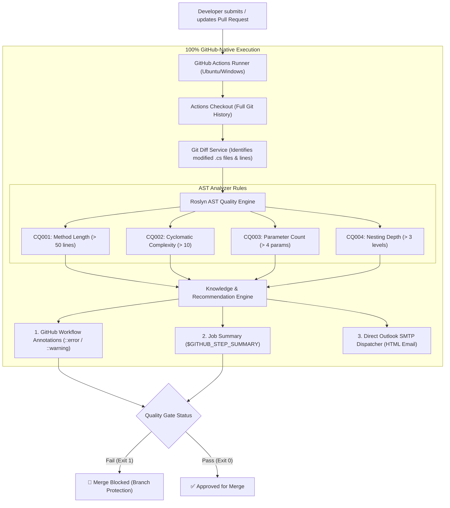

# 🛡️ Automated Code Quality Monitor (.NET + Roslyn AST + GitHub Actions + Outlook Alerting)

An end-to-end, 100% GitHub-native automated code quality analyzer and pull request gate. It performs Roslyn AST (Abstract Syntax Tree) static code analysis on modified C# files during pull requests, injects inline annotations into the GitHub PR diff, publishes rich job summaries, blocks merges on quality failures, and delivers structured HTML status emails via **Microsoft Outlook / Office 365 SMTP**.

---

## 📐 Architecture & Workflow



---

## 🔍 Roslyn AST Quality Rules

| Rule ID | Rule Name | Threshold | Severity | Recommended Fix |
| :--- | :--- | :---: | :---: | :--- |
| `CQ001` | **Method Length Exceeded** | `> 50 lines` | Warning / Error (`> 75 lines`) | Apply **Extract Method** pattern into cohesive helper functions. |
| `CQ002` | **High Cyclomatic Complexity** | `> 10 paths` | Warning / Error (`> 15 paths`) | Replace nested ladders with **Guard Clauses**, **Strategy**, or **Polymorphic** patterns. |
| `CQ003` | **Excessive Parameter Count** | `> 4 params` | Warning / Error (`> 6 params`) | Introduce a **Parameter Object / Command DTO** or Builder pattern. |
| `CQ004` | **Deep Control Flow Nesting** | `> 3 levels` | Warning / Error (`> 4 levels`) | Invert conditionals with early returns (**Fail Fast**) or extract inner logic. |

> [!TIP]
> **Incremental Scope:** The analyzer only flags violations on methods that intersect with lines modified in the PR (`git diff`). Existing legacy code remains untouched unless modified!

---

## 🚀 GitHub Actions Setup

### 1. Configure GitHub Secrets

Navigate to your repository on GitHub: **Settings > Secrets and variables > Actions > New repository secret**.

| Secret Name | Example Value | Description |
| :--- | :--- | :--- |
| `OUTLOOK_SENDER_EMAIL` | `bot@yourcompany.com` | Dedicated Outlook or Microsoft 365 sender address. |
| `OUTLOOK_APP_PASSWORD` | `xxxx xxxx xxxx xxxx` | 16-character Microsoft App Password. |
| `OUTLOOK_RECIPIENT_EMAIL` | *(Optional)* `team@yourcompany.com` | Team mailbox (defaults to PR author). |

### 2. Enable Branch Protection (Block Merge on Failure)

1. Go to **Settings > Branches > Add branch protection rule**.
2. Set branch pattern to `main` (or `master`).
3. Check **"Require status checks to pass before merging"**.
4. Select `Roslyn AST Quality Analysis & Alerting` as the required check.

---

## 💻 Local Development & Testing

### 1. Build the Tool
```powershell
dotnet build src/CodeMonitor/CodeMonitor.csproj -c Release
```

### 2. Run in Dry-Run Mode (Without sending email)
```powershell
dotnet run --project src/CodeMonitor/CodeMonitor.csproj -- --dry-run
```

### 3. Run with Live Outlook SMTP Dispatch
```powershell
$env:OUTLOOK_SENDER_EMAIL="your-email@outlook.com"
$env:OUTLOOK_APP_PASSWORD="your-app-password"
$env:OUTLOOK_RECIPIENT_EMAIL="developer@outlook.com"

dotnet run --project src/CodeMonitor/CodeMonitor.csproj
```

---

## 📧 Email Notification Preview

When violations are detected or when a PR passes, a responsive HTML email is dispatched with:
* **Status Badge:** `QUALITY VIOLATION DETECTED` (Red) or `QUALITY GATE PASSED` (Green)
* **Metadata Table:** Repository, Branch, PR link, Commit SHA, Developer info.
* **Line-by-Line Breakdown:** Exact file, line range, measured value vs allowed limit.
* **Knowledge Rationale & Suggested Refactoring:** Actionable remediation guidance.

---

## 📂 Project Structure

```text
github_codereview/
├── .github/
│   └── workflows/
│       └── code-quality.yml          # GitHub Actions PR quality gate
├── src/
│   └── CodeMonitor/
│       ├── Analyzers/
│       │   ├── ICodeAnalyzer.cs      # Analyzer contract
│       │   ├── MethodLengthAnalyzer.cs
│       │   ├── ComplexityAnalyzer.cs
│       │   ├── ParameterCountAnalyzer.cs
│       │   └── NestingDepthAnalyzer.cs
│       ├── Knowledge/
│       │   └── RecommendationEngine.cs # Architectural explanations
│       ├── Models/
│       │   ├── Violation.cs
│       │   ├── AnalysisReport.cs
│       │   └── QualityConfig.cs
│       ├── Services/
│       │   ├── GitDiffService.cs     # Git diff scoped inspection
│       │   ├── GitHubReporter.cs     # Workflow annotations & Step Summary
│       │   └── EmailService.cs       # MailKit Outlook SMTP dispatcher
│       ├── Program.cs                # CLI entry point
│       └── CodeMonitor.csproj
├── samples/
│   └── SampleApp/
│       ├── SampleApp.csproj          # Test target
│       └── OrderService.cs           # Test violations
├── .gitignore
└── README.md
```
